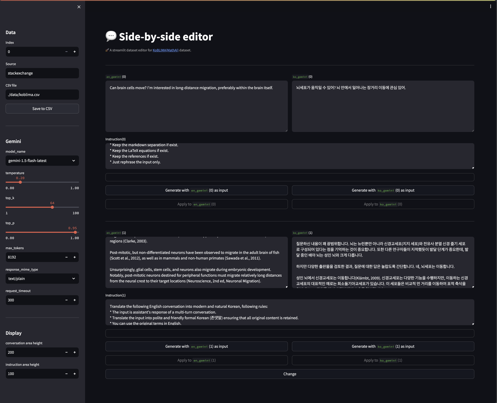

# KoBLIMA
Korean Bilingual LIMA

## [LIMA: Less Is More for Alignment](https://arxiv.org/pdf/2305.11206.pdf)

https://huggingface.co/datasets/GAIR/lima

### License

If the source data of LIMA has a stricter license than CC BY-NC-SA, the LIMA dataset follows the same. Otherwise, it follows the CC BY-NC-SA license.

### LIMA(rephrased)

Use the rephrased LIMA dataset using Gemini Flash 1.5.
The instruction can be found in `lima_gemini.py`.

To generate LIMA(rephrased) use the following:
```bash
python lima_gemini.py -o ./data/lima_r.csv -m en -oc en_gemini

### to resume generation,
python lima_gemini.py -o ./data/lima_r.csv -m en -oc en_gemini -r
```

## KoLIMA(new) and KoBLIMA

KoLIMA(new) is a Korean translation of the LIMA(rephrased), created using Google's Gemini Flash 1.5 and human curation.

While the [taeshahn/ko-lima](https://huggingface.co/datasets/taeshahn/ko-lima) dataset already exists, our KoLIMA(new) dataset differs significantly in its use of Gemini Flash 1.5 for fixing the original sentences and translation.
Furthermore, our dataset features user queries written in informal Korean (banmal, 반말) and assistant responses in formal Korean (jondaetmal, 존댓말).

The instruction for translation can be found in `lima_gemini.py`.

To generate KoLIMA(new) use the following:
```bash
python lima_gemini.py -i ./data/lima_r.csv -o ./data/koblima.csv -m ko -ic en_gemini -oc ko_gemini

### to resume generation,
python lima_gemini.py -i ./data/lima_r.csv -o ./data/koblima.csv -m ko -ic en_gemini -oc ko_gemini -r
```

KoBLIMA is a bilingual LIMA dataset with four modes: `en`, `ko`, `en_ko` and `ko_en`.
- `en`: rephrased in English.
- `ko`: translated into Korean.
- `en_ko`: the user's query is given in English and the assistant's answer is given in Korean.
- `ko_en`: the user's query is given in Korean and the assistant's answer is given in English.

One can use the `KoBLIMA` class:
```bash
git clone https://github.com/bckim-mathai/KoBLIMA.git
```

```python
from KoBLIMA import KoBLIMA

dataset = KoBLIMA('ko_en')

print(dataset[0])

### Output
{'conversation': ['뇌세포가 움직일 수 있어? 뇌 안에서 일어나는 장거리 이동에 관심 있어.',
  "The question you pose is quite broad. It's important to ..."],
 'source': 'stackexchange',
 'mode': 'ko_en'}
```

To use `KoBLIMA` class, the only requirement pakcage is `pandas`.

## Side-by-Side Editor


```bash
streamlit run editor.py
```

**Warning:** This Streamlit app is not designed for collaboration. Use it only individually.